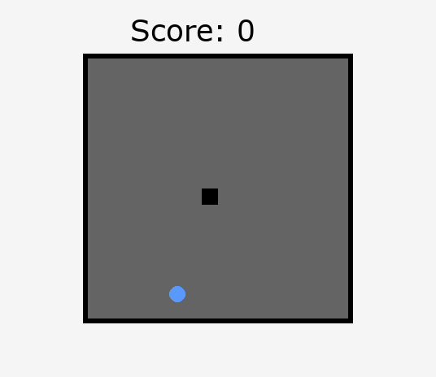

# RL-Snake

Implementation of reinforcement learning models playing the Snake game using Stable Baselines3 and Pygame.



## Features

- **Multiple RL Algorithms**: PPO, DQN, A2C support
- **Flexible Configuration**: YAML-based config with CLI overrides
- **Dual Game Modes**: Visual (Pygame) and fast (numpy-only) implementations
- **Persistent Model Architecture**: `.dill`-based model storage for architecture independence
- **Comprehensive Testing**: Unit tests for game logic and RL environment

## Quick Start

### Installation

```bash
git clone https://github.com/Dorian-MB/RL-Snake.git
cd RL-Snake
pip install -r requirements.txt
pip install -e .
```

### Training

```bash
# Train with default configuration
make train

# Train with YAML config
rl-snake-train -c config/training_config.yaml

# Train with CLI options
rl-snake-train -m PPO -g 15 -x 5
```

### Playing

```bash
# Watch trained model play
make play

# Play specific model
rl-snake-play -m PPO_snake -g 15

# Record gameplay as GIF
rl-snake-play -m PPO_snake --save-gif
```

### Evaluation

```bash
# Evaluate model over 100 episodes
rl-snake-evaluate -m PPO_snake -e 100
```

## Project Structure

```
RL-Snake/
├── src/rl_snake/           # Main package
│   ├── config/             # Configuration and constants
│   ├── game/               # Snake game implementations
│   ├── environment/        # RL environment (Gymnasium)
│   ├── agents/             # Training and feature extraction
│   └── scripts/            # CLI entry points
├── config/                 # YAML configuration files
├── models/                 # Trained models (with .dill architecture)
├── logs/                   # TensorBoard logs
├── gifs/                   # Generated GIF recordings
└── tests/                  # Unit tests
```

## Documentation

- **[Configuration System](config/README.md)**: YAML configuration guide and options
- **[Entry Points](docs/ENTRY_POINTS.md)**: CLI commands and script usage
- **[Model Storage](docs/MODEL_STORAGE.md)**: Model architecture persistence with `.dill`
- **[Callbacks](docs/CALLBACKS.md)**: Training callbacks and curriculum learning

## Key Commands

```bash
# Development
make test              # Run tests
make lint              # Code quality checks

# Training
make train             # Train PPO model
rl-snake-train         # Train with default config

# Visualization
make play              # Watch trained model
rl-snake-play          # Play specific model

# Analysis
make evaluate          # Evaluate trained model
make tensorboard       # Start TensorBoard
```

## Entry Points

The package provides four CLI commands:

| Command | Purpose |
|---------|---------|
| `rl-snake-train` | Train RL models |
| `rl-snake-play` | Watch trained models play |
| `rl-play-snake` | Play Snake manually |
| `rl-snake-evaluate` | Evaluate model performance |

See [Entry Points Documentation](docs/ENTRY_POINTS.md) for detailed usage.

## Architecture Overview

- **Game Engine**: `SnakeGame` (pygame) and `FastSnakeGame` (numpy-only)
- **RL Environment**: `SnakeEnv` (Gymnasium-compatible) with custom observation space
- **Feature Extraction**: `LinearQNet` custom neural network
- **Trainers**: `ModelTrainer` with PPO/DQN/A2C support

## Quick Examples

### Training with Custom Configuration

```bash
# Create custom config
cp config/training_config.yaml config/my_config.yaml
# Edit my_config.yaml...

# Train with custom config
rl-snake-train -c config/my_config.yaml
```

### Training with CLI Overrides

```bash
# Override specific parameters
rl-snake-train -g 20 --total-timesteps 500000 --n-envs 10

# Enable curriculum learning
rl-snake-train --enable-curriculum --curriculum-start 8 --curriculum-end 20
```

### Monitoring Training

```bash
# Start TensorBoard (in separate terminal)
tensorboard --logdir=logs

# View at http://localhost:6006
```

## Model Storage

Models are saved with architecture persistence:

```
models/PPO_snake/
├── PPO_snake.zip                # Model weights
├── feature_extractor.dill       # Network architecture class
└── feature_extractor_kwargs.json # Architecture parameters
```

This ensures models remain loadable even after code changes. See [Model Storage Documentation](docs/MODEL_STORAGE.md) for details.

## License

MIT License - see LICENSE file for details.
