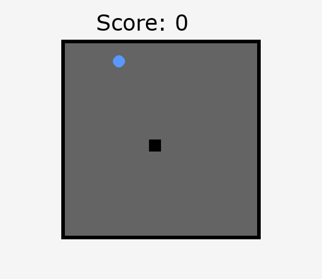

# RL-Snake

Implementation of reinforcement learning models playing the Snake game using Stable Baselines3 and Pygame.



## Features

- **Multiple RL Algorithms**: Support for PPO, DQN, and A2C
- **Flexible Configuration System**: YAML-based configuration with CLI override support
- **Flexible Game Engine**: Both visual (Pygame) and fast (numpy-only) implementations
- **Modern Python Structure**: Follows PEP 8 and modern packaging standards
- **Comprehensive Testing**: Unit tests for game logic and RL environment
- **Easy-to-use Scripts**: Simple command-line interface for training and evaluation
- **Pre-configured Training Profiles**: Ready-to-use configurations for different scenarios
- **GIF Recording**: Record gameplay sessions as animated GIF files

## Project Structure

```
RL-Snake/
├── src/rl_snake/           # Main package
│   ├── config/              # Configuration management & constant
│   ├── game/               # Snake game implementations
│   ├── environment/        # RL environment and utilities
│   ├── agents/             # RL agents and training utilities
│   └── scripts/            # Command-line scripts
├── config/                 # Configuration files
│   ├── training_config.yaml    # Default training configuration
│   ├── quick_training.yaml     # Fast training for development
│   └── production_training.yaml # Production-ready training
├── tests/                  # Unit tests
├── notebooks/              # Jupyter notebooks
├── models/                 # Trained models
├── logs/                   # Training logs
├── gifs/                   # Generated GIF recordings
└── requirements.txt        # Dependencies
```

## Installation

1. Clone the repository:

```bash
git clone https://github.com/Dorian-MB/RL-Snake.git
cd RL-Snake
```

2. Create and activate a virtual environment:

```bash
python -m venv env
source env/bin/activate  # On Windows: env\Scripts\activate
```

3. Install dependencies:

```bash
pip install -r requirements.txt
```

4. Install the package in development mode:

```bash
pip install -e .
```

## Usage

### Training a Model

```bash
# Train a PPO model
python scripts/train.py -m PPO -g 15 -x 5

# Train a DQN model with custom settings
python scripts/train.py -m DQN -g 20 -n 8 -x 10
```

### Playing with a Trained Model

```bash
# Watch a trained model play
rl-snake-play -m PPO_4layers64

# Use specific game settings
rl-snake-play -m PPO_4layers64 -g 20

# Record gameplay as GIF
rl-snake-play -m PPO_4layers64 --save-gif

# Record with custom filename and path
rl-snake-play -m PPO_4layers64 --save-gif --gif-path="gifs/my_agent.gif"
```

### Evaluating Model Performance

```bash
# Evaluate over 100 episodes
rl-snake-evaluate -m PPO_4layers64 -e 100
```

## Training Options

- `-m, --model`: Model type (PPO, DQN, A2C)
- `-g, --game_size`: Game grid size (default: 15)
- `-n, --n-envs`: Number of parallel environments (default: 5)
- `-x, --multiplicator`: Training time multiplier (default: 5)
- `-f, --fast-game`: Use fast game implementation
- `--use-frame-stack`: Enable frame stacking
- `-u, --use-policy-kwargs`: Use custom neural network architecture

## GIF Recording Options

When using `rl-snake-play`, you can record gameplay sessions as animated GIF files:

- `--save-gif`: Enable GIF recording
- `--gif-path PATH`: Specify custom output path (auto-generated if not provided)

### GIF Recording Examples

```bash
# Basic GIF recording (auto-generated filename)
rl-snake-play -m PPO_4layers64 --save-gif

# Custom filename with timestamp
rl-snake-play -m PPO_4layers64 --save-gif --gif-path="gifs/snake_$(date +%Y%m%d_%H%M%S).gif"

# Record larger game grid
rl-snake-play -m PPO_4layers64 -g 20 --save-gif --gif-path="gifs/snake_20x20.gif"
```

GIF files are saved with 10 FPS and will automatically loop when viewed in browsers or image viewers.

## Callbacks Configuration

The training system supports configurable callbacks for enhanced monitoring and control:

### Available Callbacks

- **Progress Callback**: Custom progress tracking with episode metrics
- **Curriculum Learning**: Gradually increase game difficulty during training
- **Metrics Logging**: Advanced metrics collection and logging
- **Model Saving**: Periodic model checkpointing during training

### Callbacks in Configuration Files

```yaml
callbacks:
  enabled: true # Enable/disable all callbacks
  use_progress: true # Custom progress tracking
  use_curriculum: false # Curriculum learning
  use_metrics: false # Advanced metrics logging
  use_save: true # Periodic model saving
  curriculum_start: 10 # Starting grid size for curriculum
  curriculum_end: 20 # Ending grid size for curriculum
  save_freq: 50000 # Save frequency (timesteps)
```

### Callbacks Command Line Options

- `--no-callbacks`: Disable all callbacks
- `--no-progress-callback`: Disable custom progress callback
- `--enable-curriculum`: Enable curriculum learning
- `--enable-metrics`: Enable metrics logging
- `--no-save-callback`: Disable model saving
- `--save-freq N`: Set save frequency (default: 50000)
- `--curriculum-start N`: Set curriculum starting size (default: 10)
- `--curriculum-end N`: Set curriculum ending size (default: 20)

### Training Examples with Callbacks

```bash
# Training with all callbacks enabled
python -m src.rl_snake.agents.trainer -c config/production_training.yaml

# Training without any callbacks
python -m src.rl_snake.agents.trainer -c config/minimal_training.yaml

# Training with custom callback settings
python -m src.rl_snake.agents.trainer --enable-curriculum --curriculum-start 8 --curriculum-end 15

# Quick training without saving
python -m src.rl_snake.agents.trainer -c config/quick_training.yaml --no-save-callback
```

## Architecture

### Game Engine

- **SnakeGame**: Full pygame implementation with graphics
- **FastSnakeGame**: Lightweight numpy-only implementation for fast training

### RL Environment

- **BaseSnakeEnv**: Base Gymnasium-compatible environment, for snake game.
- **SnakeEnv**: Simple snake env
  - Custom feature extraction (neighbors, distance to food, angle)
  - Custom configurable reward system

### Agents

- **ModelTrainer**: Handles model creation and training
- **LinearQNet**: Custom feature extractor
- Evaluation utilities and model management

## Monitoring Training

Training logs are saved to the `logs/` directory and can be visualized with TensorBoard:

```bash
tensorboard --logdir=logs
```

## License

MIT License - see LICENSE file for details.
